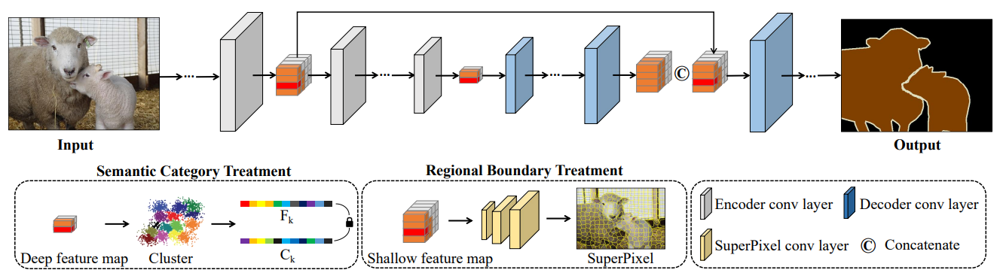

MODEL DOCTOR FOR DIAGNOSING AND TREATING SEGMENTATION ERROR
--------

## Abstract

Despite the remarkable progress in semantic segmentation tasks with the advancement of deep neural networks, existing U-shaped hierarchical typical segmentation networks still suffer from local misclassification of categories and inaccurate target boundaries. In an effort to alleviate this issue, we propose a Model Doctor for semantic segmentation problems. The Model Doctor is designed to diagnose the aforementioned problems in existing pre-trained models and treat them without introducing additional data, with the goal of refining the parameters to achieve better performance. Extensive experiments on several benchmark datasets demonstrate the effectiveness of our method.

## Framework



A synopsis of our proposed methodology, which is comprised of two facets: the semantic category treatment applied to the deep features $M_{D}$, and the regional boundary treatment applied to the shallow features $M_{S}$.
## Usage

### Installation
Our experimental environment is `python 3.8 & pytorch 1.12.1+cu113`. We strongly recommend you use `pytorch >= 1.11.0` for its less GPU memory consumption. 
```python
  argparse
  albumentations == 1.3.0
  numpy
```

### Dataset
VOC2012 is used to validate our method [[百度网盘]](https://pan.baidu.com/s/1vkk3lMheUm6IjTXznlg7Ng?pwd=44mk).

The directory structure is as follows: 
```
VOCdevkit/
  ├── VOC2012
    ├── ImageSets/
    ├── JPEGImages/
    └── SegmentationClassAug/
```

The pretrained model in [[百度网盘]](https://pan.baidu.com/s/1967fppZDAtRyIJ9HLM13Ag?pwd=dk9k).

### Training

```bash   
python finetune_seg.py \
--num_classes 21 \
--batch_size 8 \
--lr 1e-3 \

```

## How to integrate into your model

The segdoctor contains two parts: semantic category therapy, and regional boundary therapy.

For details, you can refer to our code. Reference *uet_resnet.py spixel.py* select appropriate features for semantic therapy and boundary therapy.

## LICENSE

Licensed under the Apache License, Version 2.0 (the "License"); you may not use these files except in compliance with the License. You may obtain a copy of the License at http://www.apache.org/licenses/LICENSE-2.0

Unless required by applicable law or agreed to in writing, software distributed under the License is distributed on an "AS IS" BASIS, WITHOUT WARRANTIES OR CONDITIONS OF ANY KIND, either express or implied. See the License for the specific language governing permissions and limitations under the License.

## BibTex
If you find segdoctor useful in your research, please consider citing:   
```bibtex
coming soon ...
```
